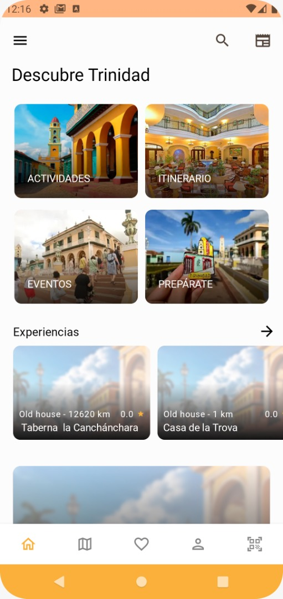
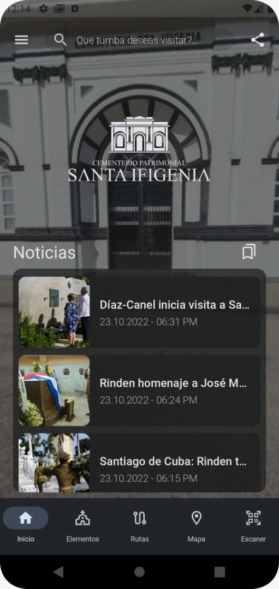
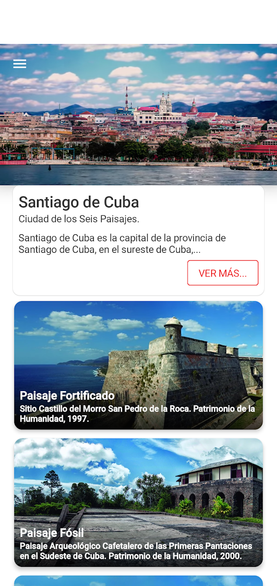
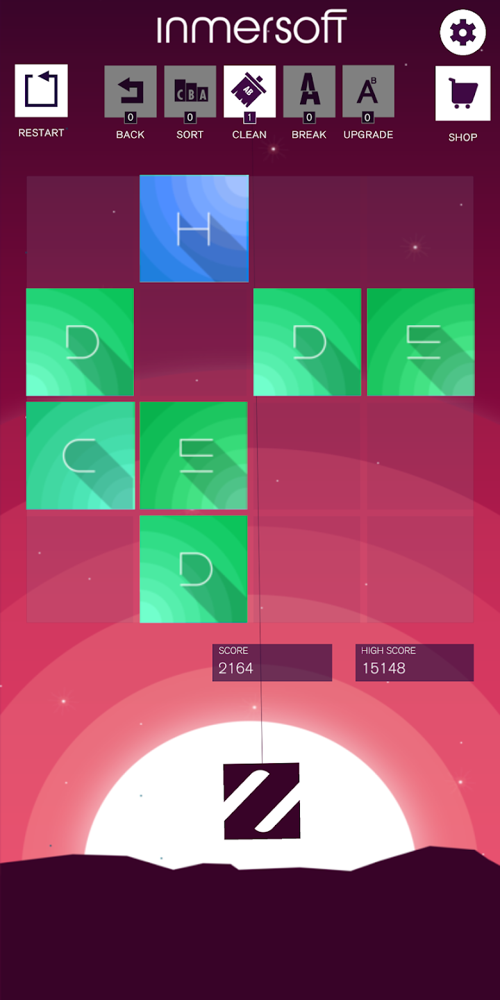
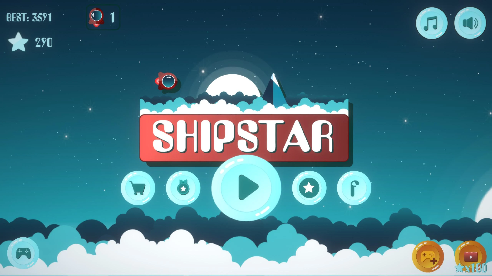
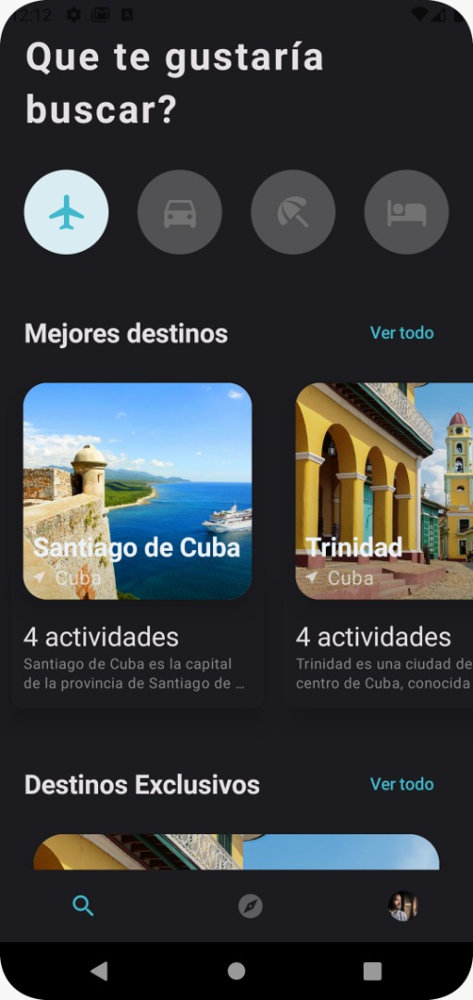

<h1 align="start">Hi there! 👋🏻</h1>
<h2 align="start">I'm Orlando Novas Rodriguez</h2>
<h3 align="start">I'm a passionate Native Android Developer ♥ Kotlin ♥ Jetpack Compose</h3>

*************

## About me:

Hello! My name is Orlando, I am a native mobile application developer for the Android platform. I have spent several years in a process of continuous learning of new technologies, libraries, best practices of architecture, Kotlin, Coroutines, reactive functional programming and a while ago I started with the study of Jetpack Compose. Over the course of all this time I have had the opportunity to gain new knowledge by paying close attention to all phases of mobile application development from initial idea, planning and requirements gathering to successful product delivery. All this has allowed me to have a greater command of the patterns and the best practices to follow for the development of high quality mobile applications and I have applied this knowledge in each of the projects in which I have participated.

In the course of my career as a developer, I have used several frameworks such as Flutter, React, NodeJs with which I have helped to create excellent products for both web and mobile; But some time ago I made the decision to specialize in Native Android Development and since then I have remained in that branch of software development which I consider the best line of work for me.

I have acquired skills with the following tools and libraries that have allowed me to have good productivity when creating mobile applications.
 

 

## Skills:

 

 

 

 

*************  
## Some Projects:

###Some applications in which I have collaborated as an Android Developer.

* Descubre Trinidad   
   
 <table>
<tr>
  <td  width="70%">
   

 Discover Trinidad is an interactive digital Guide created by Inmersoft, this app has been migrated three times; the first time it was a monolithic style app, then it was migrated to use an API also created by Inmersoft and the third migration is still in progress, which is a total redesign of its interface and this time using Jetpack Compose; This is the app that I have worked on the longest, about two years since its creation and in which I have tried to capture the best practices of mobile development.
   
   
   
 </td>
 <td>

 
 </td>
  </tr> 
 
</table>

* Santa Ifigenia Cemetery     
    
 <table>
<tr>
  <td  width="70%">
  Paisajes Santiago is an app built entirely in Jetpack Compose using Material Design 2, Exoplayer, 
 Room among other libraries.
If you decide to visit Santiago de Cuba, without a doubt this is the app you need. 
 Do you need help to organize your visit? Are you looking for a complete, versatile and 
 entertaining audio guide? Do you want to be up to date with the events of the city? Download this app,
 choose your route... and start exploring Santiago de Cuba in the way that best suits you!

 </td>
 <td>

 
 </td>
  </tr> 
 
</table>

* Paisajes Santiagueros     
     
 <table>
<tr>
  <td  width="70%">
  Paisajes Santiago is an app built entirely in Jetpack Compose using Material Design 2, Exoplayer, 
 Room among other libraries.
If you decide to visit Santiago de Cuba, without a doubt this is the app you need. 
 Do you need help to organize your visit? Are you looking for a complete, versatile and 
 entertaining audio guide? Do you want to be up to date with the events of the city? Download this app,
 choose your route... and start exploring Santiago de Cuba in the way that best suits you!

 </td>
 <td>
  
 
 </td>
  </tr> 
 
</table>

* Patrimonial Santa Ifigenia   https://play.google.com/store/apps/details?id=com.inmersoft.santiago  
   
 <table>
<tr>
  <td  width="70%">
  Paisajes Santiago is an app built entirely in Jetpack Compose using Material Design 2, Exoplayer, 
 Room among other libraries.
If you decide to visit Santiago de Cuba, without a doubt this is the app you need. 
 Do you need help to organize your visit? Are you looking for a complete, versatile and 
 entertaining audio guide? Do you want to be up to date with the events of the city? Download this app,
 choose your route... and start exploring Santiago de Cuba in the way that best suits you!

 </td>
 <td>

 
 </td>
  </tr> 
 
</table>

* Z2048   https://play.google.com/store/apps/details?id=com.inmersoft.santiago  
   
 <table>
<tr>
  <td  width="70%">
  Paisajes Santiago is an app built entirely in Jetpack Compose using Material Design 2, Exoplayer, 
 Room among other libraries.
If you decide to visit Santiago de Cuba, without a doubt this is the app you need. 
 Do you need help to organize your visit? Are you looking for a complete, versatile and 
 entertaining audio guide? Do you want to be up to date with the events of the city? Download this app,
 choose your route... and start exploring Santiago de Cuba in the way that best suits you!

 </td>
 <td>

 
 </td>
  </tr> 
 
</table>

* ShipStar   https://play.google.com/store/apps/details?id=com.inmersoft.santiago  
   
 <table>
<tr>
  <td  width="70%">
  Paisajes Santiago is an app built entirely in Jetpack Compose using Material Design 2, Exoplayer, 
 Room among other libraries.
If you decide to visit Santiago de Cuba, without a doubt this is the app you need. 
 Do you need help to organize your visit? Are you looking for a complete, versatile and 
 entertaining audio guide? Do you want to be up to date with the events of the city? Download this app,
 choose your route... and start exploring Santiago de Cuba in the way that best suits you!

 </td>
 <td>

 
 </td>
  </tr> 
 
</table>

* ShipStar   https://play.google.com/store/apps/details?id=com.inmersoft.santiago  
   
 <table>
<tr>
  <td  width="70%">
  Paisajes Santiago is an app built entirely in Jetpack Compose using Material Design 2, Exoplayer, 
 Room among other libraries.
If you decide to visit Santiago de Cuba, without a doubt this is the app you need. 
 Do you need help to organize your visit? Are you looking for a complete, versatile and 
 entertaining audio guide? Do you want to be up to date with the events of the city? Download this app,
 choose your route... and start exploring Santiago de Cuba in the way that best suits you!

 </td>
 <td>

 
 </td>
  </tr> 
 
</table>

 

*************  
 
## CodeRank:
 
 
************* 

## Find me at:

************* 

## 🏆GitHub Trophies

************* 
 

 
